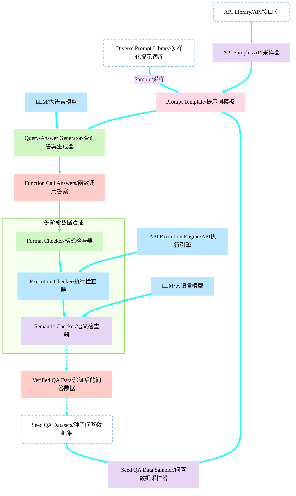

## 数据合成的原理（function calls）
下图介绍了，在function calls效果不佳的时候，如何通过数据合成的方法，将垂直领域的特定function calls训练到大模型能力里面去。亮点是通过直接调用函数返回结果的方式，来获取训练数据

这里面diverse prompt library可以使用任何一个function call数据集来冷启动

```mermaid
%%{init: {
  'theme': 'base',
  'themeVariables': { 
    'fontFamily': 'Microsoft YaHei',
    'lineColor': '#1ff',
    'arrowheadColor': '#1ff'
  }
}}%%
graph TB
    %% 定义样式
    classDef apiBox fill:#fff,stroke:#77b3f9,stroke-width:2px,stroke-dasharray: 5 5,color:#000,font-family:Microsoft YaHei
    classDef purpleBox fill:#e6d5f5,stroke:none,color:#000,font-family:Microsoft YaHei
    classDef pinkBox fill:#ffd7e5,stroke:none,color:#000,font-family:Microsoft YaHei
    classDef greenBox fill:#d1f7c4,stroke:none,color:#000,font-family:Microsoft YaHei
    classDef salmonBox fill:#ffccc7,stroke:none,color:#000,font-family:Microsoft YaHei
    classDef lightBlueBox fill:#bae7ff,stroke:none,color:#000,font-family:Microsoft YaHei
    classDef verificationBox fill:#f6ffed,stroke:#95de64,stroke-width:2px,color:#000,font-family:Microsoft YaHei
    %% 定义连线样式
    linkStyle default stroke:#1ff,stroke-width:4px

    %% 定义主要组件
    apiLib[API Library/API接口库]:::apiBox
    seedQA[Seed QA Datasets/种子问答数据集]:::apiBox
    apiSampler[API Sampler/API采样器]:::purpleBox
    seedSampler[Seed QA Data Sampler/问答数据采样器]:::purpleBox
    promptLib[Diverse Prompt Library/多样化提示词库]:::apiBox
    promptTemp[Prompt Template/提示词模板]:::pinkBox
    llm1[LLM/大语言模型]:::lightBlueBox
    qaGen[Query-Answer Generator/查询答案生成器]:::greenBox
    funcAnswers[Function Call Answers/函数调用答案]:::salmonBox
    
    %% Multi-Stage Data Verification 组件
    subgraph verification[多阶段数据验证]
        formatCheck[Format Checker/格式检查器]:::greenBox
        execCheck[Execution Checker/执行检查器]:::lightBlueBox
        semanticCheck[Semantic Checker/语义检查器]:::purpleBox
    end
    
    %% 其他组件
    llm2[LLM/大语言模型]:::lightBlueBox
    apiEngine[API Execution Engine/API执行引擎]:::lightBlueBox
    verifiedQA[Verified QA Data/验证后的问答数据]:::salmonBox

    %% 定义连接关系
    apiLib --> apiSampler
    seedQA --> seedSampler
    promptLib -- Sample/采样 --> promptTemp
    apiSampler --> promptTemp
    seedSampler --> promptTemp
    llm1 --> qaGen
    promptTemp --> qaGen
    

    qaGen --> funcAnswers
funcAnswers --> formatCheck
    formatCheck --> execCheck
    execCheck --> semanticCheck
    
    llm2 --> semanticCheck
    apiEngine --> execCheck
    
    semanticCheck -.-> verifiedQA
    verifiedQA -.-> seedQA

    %% 设置verification子图样式
    style verification fill:#f6ffed,stroke:#95de64,stroke-width:2px,color:#000,font-family:Microsoft YaHei
```
